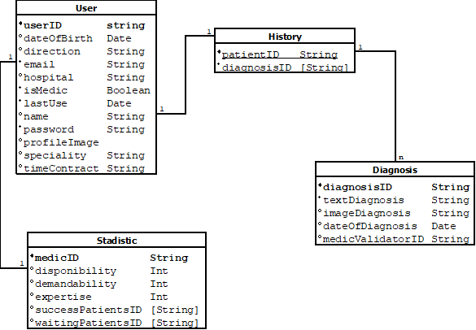

# uniMedic-DB 💾

  

Especificaciones:
- Solo los médicos podrán tener estadísticas
- Un médico tendrá acceso a varios historiales de los pacientes
- Un historial tendrá varios diagnósticos de los pacientes (ordenaodos por fecha)
- El diagnóstico inicial es la salida del chatbot IA, y contiene texto y/o imagen(es)
- Los diagnósticos pueden ser validados o no por un médico
- Los pacientes pueden calificar a los médicos con hasta 5 estrellas
- Los pacientes y médicos pueden descargar el diagnóstico del paciente (en formato PDF)
- Primero se crea el diagnóstico y luego se guarda en la colección Historial (sólo para las pruebas, cree primero el Historial)

Rutas actuales:

- ✅ User: signup (POST), signin (POST), patients (GET), patient (GET)
- ✅ Stadistic: register (POST), updateCircularStats (POST), addWaitingPatient (POST), changeStateWaitingPatient (POST), data (GET)
- ✅ Historial: register (POST), update (POST)
- ✅ Diagnosis: register (POST), update (POST), lastDiagnosis (GET), downloadPDF (GET)

*Nota*: 
- De momento no hay métodos para borrar (DELETE) documentos (no es necesario)
- Los PDF descargados se nombran por diagnosis_patientID.pdf
- Los diagnosisID se nombran con diagnosis + patientID + lastUse
- Los userID se nombran con nameUser + birthday
